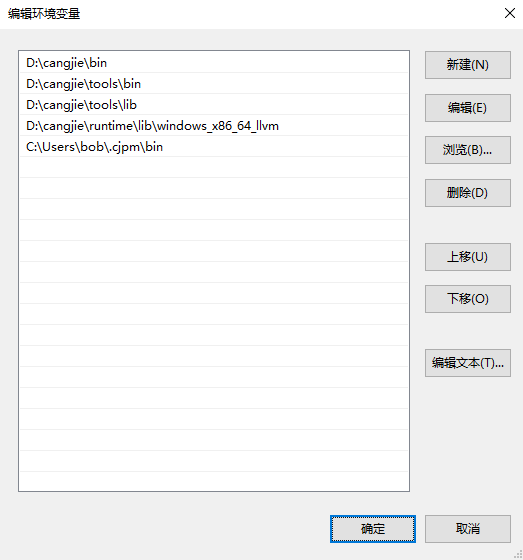

# 安装仓颉工具链

在开发仓颉程序时，必用的工具之一是仓颉编译器，它可以将仓颉源代码编译为可运行的二进制文件，但现代编程语言的配套工具并不止于此，实际上，仓颉为开发者提供了编译器、调试器、包管理器、静态检查工具、格式化工具和覆盖率统计工具等一整套仓颉开发工具链，同时提供了友好的安装和使用方式，基本能做到“开箱即用”。

目前仓颉工具链已适配部分版本的 Linux、macOS 和 Windows 平台，但是仅针对部分 Linux 发行版做了完整功能测试，详情可参阅附录[Linux 版本工具链的支持与安装](../Appendix/linux_toolchain_install.md)章节，在暂未进行过完整功能测试的平台上，仓颉工具链的功能完整性不受到保证。此外，当前 Windows 平台上的仓颉编译器基于 MinGW 实现，相较于 Linux 版本的仓颉编译器，功能会有部分欠缺。

## Linux / macOS

### 环境准备

#### Linux

Linux 版仓颉工具链的系统环境要求如下：

| 架构    | 环境要求                                                     |
| ------- | ------------------------------------------------------------ |
| x86_64  | glibc 2.22，Linux Kernel 4.12 或更高版本，系统安装 libstdc++ 6.0.24 或更高版本 |
| aarch64 | glibc 2.27，Linux Kernel 4.15 或更高版本，系统安装 libstdc++ 6.0.24 或更高版本 |

除此之外，对于 Ubuntu 18.04，还需要安装相应的依赖软件包：

```bash
$ apt-get install binutils libc-dev libc++-dev libgcc-7-dev
```

更多 Linux 发行版的依赖安装命令可以参见附录[Linux 版本工具链的支持与安装](../Appendix/linux_toolchain_install.md)章节。

此外，仓颉工具链还依赖 OpenSSL 3 组件，由于该组件可能无法从以上发行版的默认软件源直接安装，因此需要自行手动安装，安装方式请参见附录[Linux 版本工具链的支持与安装](../Appendix/linux_toolchain_install.md)章节。

#### macOS

macOS 版仓颉工具链支持在 macOS 12.0 及以上版本（aarch64 架构）运行。

使用 macOS 版本前需要安装相应的依赖软件包，可以通过执行以下命令安装：

```bash
$ brew install libffi
```

### 安装指导

首先请前往[仓颉官网](https://cangjie-lang.cn/download)，下载适配平台架构的安装包：

- `cangjie-sdk-linux-x64-x.y.z.tar.gz`：适用于 x86_64 架构 Linux 系统的仓颉工具链
- `cangjie-sdk-linux-aarch64-x.y.z.tar.gz`：适用于 aarch64 架构 Linux 系统的仓颉工具链
- `cangjie-sdk-mac-aarch64-x.y.z.tar.gz`：适用于 aarch64/arm64 架构 macOS 系统的仓颉工具链

假设这里选择了 `cangjie-sdk-linux-x64-x.y.z.tar.gz`，下载到本地后，请执行如下命令解压：

```bash
tar xvf cangjie-sdk-linux-x64-x.y.z.tar.gz
```

解压完成，可以在当前工作路径下看到一个名为 `cangjie` 的目录，其中存放了仓颉工具链的全部内容，请执行如下命令完成仓颉工具链的安装配置：

```bash
source cangjie/envsetup.sh
```

为了验证是否安装成功，可以执行如下命令：

```bash
cjc -v
```

其中 `cjc` 是仓颉编译器的可执行文件名，如果在命令行中看到了仓颉编译器版本信息，表示已经成功安装了仓颉工具链。值得说明的是，`envsetup.sh` 脚本只是在当前 shell 环境中配置了工具链相关的环境变量，所以仓颉工具链仅在当前 shell 环境中可用，在新的 shell 环境中，需要重新执行 `envsetup.sh` 脚本配置环境。

若想使仓颉工具链的环境变量配置在 `shell` 启动时自动生效，可以在 `$HOME/.bashrc` 或 `$HOME/.zshrc`（依 `shell` 种类而定）等 `shell` 初始化配置文件的最后加入以下命令：

```shell
# 假设仓颉安装包解压在 /home/user/cangjie 中
source /home/user/cangjie/envsetup.sh  # 即 envsetup.sh 的绝对路径
```

配置完成后 shell 启动即可直接使用仓颉编译工具链。

### 卸载与更新

在 Linux 和 macOS 平台，删除上述仓颉工具链的安装包目录，同时移除上述环境变量（最简单的，可以新开一个 shell 环境），即可完成卸载。

```bash
$ rm -rf <path>/<to>/cangjie
```

若需要更新仓颉工具链，需要先卸载当前版本，然后按上述指导重新安装最新版本的仓颉工具链。

## Windows

本节以 Windows 10 平台为例，介绍仓颉工具链的安装方式。

### 安装指导

在 Windows 平台上，仓颉为开发者提供了 `exe` 和 `zip` 两种格式的安装包，请前往[仓颉官网](https://cangjie-lang.cn/download)，选择和下载适配平台架构的 Windows 版安装包。

- 如果选择 `exe` 格式的安装包（例如 `cangjie-sdk-windows-x64-x.y.z.exe`），请直接执行此文件，跟随安装向导点击操作，即可完成安装。

- 如果选择 `zip` 格式的安装包（例如 `cangjie-sdk-windows-x64-x.y.z.zip`），请将它解压到适当目录，在安装包中，仓颉为开发者提供了三种不同格式的安装脚本，分别是 `envsetup.bat`，`envsetup.ps1` 和 `envsetup.sh`，可以根据使用习惯及环境配置，选择一种执行：

    - 若使用 Windows 命令提示符（CMD）环境，请执行：

        ```bash
        path\to\cangjie\envsetup.bat
        ```

    - 若使用 PowerShell 环境，请执行：

        ```bash
        . path\to\cangjie\envsetup.ps1
        ```

    - 若使用 MSYS shell、bash 等环境，请执行：

        ```bash
        source path/to/cangjie/envsetup.sh
        ```

    为了验证是否安装成功，请在以上命令环境中继续执行 `cjc -v` 命令，如果输出了仓颉编译器版本信息，表示已经成功安装了仓颉工具链。

**值得注意的是**，基于 zip 安装包和执行脚本的安装方式，类似于 Linux 平台，即 envsetup 脚本所配置的环境变量，只在当前命令行环境中有效，如果打开新的命令行窗口，需要重新执行 envsetup 脚本配置环境。此时，若想使仓颉工具链的环境变量配置在命令提示符或终端启动时自动生效，可以对系统进行如下配置：

- 若使用 bash 环境，可以根据如下步骤操作：

    在 `$HOME/.bashrc` 初始化配置文件的最后加入以下命令（`$HOME` 为当前用户目录的路径）：

    ```shell
    # 假设仓颉安装包解压在 /home/user/cangjie 中
    source /home/user/cangjie/envsetup.sh  # 即 envsetup.sh 的绝对路径
    ```

    配置完成后 bash 启动即可直接使用仓颉编译工具链。

- 若使用 Windows 命令提示符（CMD）、PowerShell 或其他环境，可以根据如下步骤操作：

    1. 在 Windows 搜索框中，搜索 “查看高级系统设置” 并打开对应窗口；

    2. 点击 “环境变量” 按钮；

    3. 执行如下操作，配置 CANGJIE_HOME 变量：

        1. 在 “用户变量”（为当前用户进行配置）或 “系统变量”（为系统所有用户进行配置）区域中，查看是否已有 CANGJIE_HOME 环境变量。若没有，则点击 “新建” 按钮，并在 “变量名” 字段中输入 `CANGJIE_HOME` ；若有，则说明该环境可能已经进行过仓颉配置，如果想要继续为当前的仓颉版本进行配置并覆盖原配置，请点击 “编辑” 按钮，进入 “编辑系统变量” 窗口。

        2. 在 “变量值” 字段中输入仓颉安装包的解压路径，若原先已经存在路径，则使用新的路径覆盖原有的路径，例如仓颉安装包解压在 `D:\cangjie` ，则输入 `D:\cangjie` 。

        3. 配置完成后 “编辑用户变量” 或 “编辑系统变量” 窗口应如下图所示。确认路径正确配置后点击 “确定” 按钮。

            

    4. 执行如下操作，配置 Path 变量：

        1. 在 “用户变量”（为当前用户进行配置）或 “系统变量”（为系统所有用户进行配置）区域中，找到并选择 Path 变量，点击 “编辑” 按钮，进入 “编辑环境变量” 窗口。

        2. 分别点击 “新建” 按钮，并分别输入 `%CANGJIE_HOME%\bin` 、 `%CANGJIE_HOME%\tools\bin` 、 `%CANGJIE_HOME%\tools\lib` 、 `%CANGJIE_HOME%\runtime\lib\windows_x86_64_llvm` (`%CANGJIE_HOME%` 为仓颉安装包的解压路径)。例如，仓库安装包解压在 `D:\cangjie` ，则新建的环境变量分别为： `D:\cangjie\bin` 、 `D:\cangjie\tools\bin` 、 `D:\cangjie\tools\lib` 、 `D:\cangjie\runtime\lib\windows_x86_64_llvm` 。

        3. （仅适用于为当前用户设置）点击 “新建” 按钮，并输入当前用户目录路径，并在路径后面添加 `.cjpm\bin` 。例如用户路径在 `C:\Users\bob` ，则输入 `C:\Users\bob\.cjpm\bin` 。

        4. 配置完成后应能在 “编辑环境变量” 窗口中看到配置的路径，例如下图所示。确认路径正确配置后点击 “确定” 按钮。

            

    5. 点击 “确定” 按钮，退出 “环境变量” 窗口。

    6. 点击 “确定” 按钮，完成设置。

    > **注意：**
    >
    > 设置完成后可能需要重启命令行窗口或重启系统以让设置生效。

    配置完成后 Windows 命令提示符（CMD）或 PowerShell 启动即可直接使用仓颉编译工具链。

### 卸载与更新

- 如果选择 `exe` 格式的安装包进行的安装，运行仓颉安装目录下的 `unins000.exe` 可执行文件，跟随卸载向导点击操作，即可完成卸载。

- 如果选择 `zip` 格式的安装包进行的安装，删除仓颉工具链的安装包目录，同时移除上述环境变量设置（若有），即可完成卸载。

若需要更新仓颉工具链，需要先卸载当前版本，然后按上述指导重新安装最新版本的仓颉工具链。
