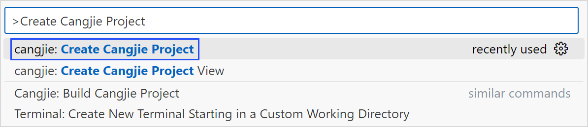
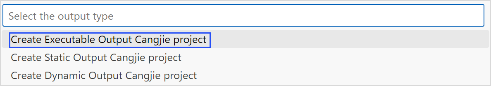
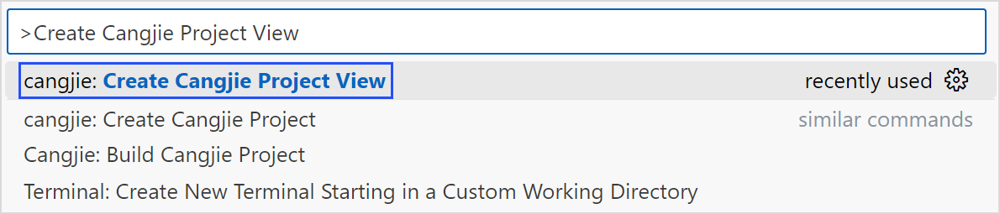
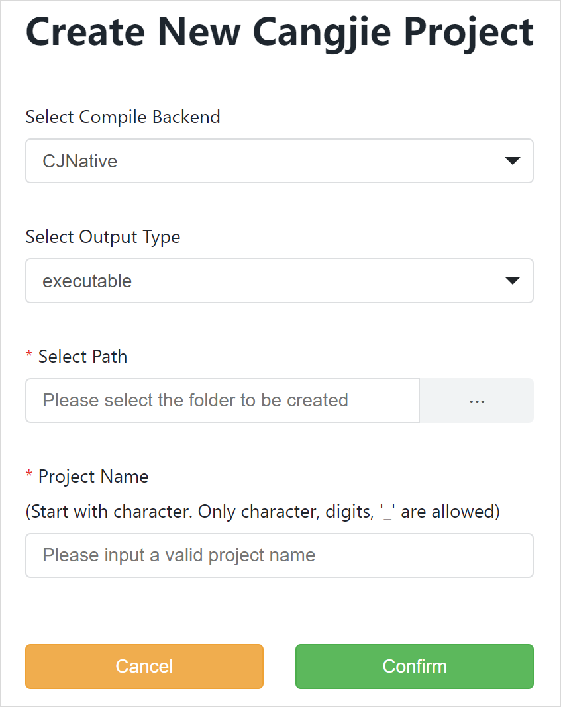
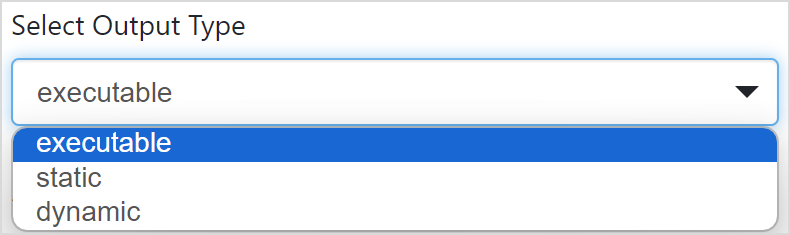
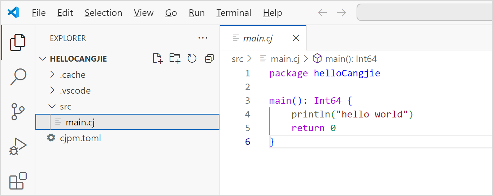

# 创建仓颉工程

> **说明：**
>
> 本文档部分图片截取于 VSCode 软件界面，仅用于说明仓颉插件在 VSCode 中的使用方法。

仓颉工程目录结构如下所示。

```text
Project_name：开发者输入的名称

├── src：代码目录

│    └── main.cj：源码文件

└── cjpm.toml：默认的 cjpm.toml 配置文件
```

## 使用 VSCode 命令面板

在 VSCode 中使用快捷键 F1，或同时按下 Ctrl + Shift + P（macOS 系统为 Command + Shift + P）打开命令面板，按照以下步骤创建仓颉工程。

**第一步：选择创建仓颉工程命令**



**第二步：选择仓颉后端**


**第三步：选择工程模板**



**第四步：选择工程路径**


**第五步：输入工程名称**

选择工程的存储路径，输入工程名称。

**第六步：完成创建并打开**


## 使用可视化界面

在 VSCode 中使用快捷键 F1，或同时按下 Ctrl + Shift + P（macOS 系统为 Command + Shift + P）打开命令面板，按照以下步骤创建仓颉工程。

**第一步：选择创建仓颉可视化工程命令**



**第二步：打开可视化创建仓颉工程界面**



**第三步：选择工程模板**



**第四步：选择工程路径**


**第五步：输入工程名称**


**第六步：单击 Confirm 完成创建并打开**


